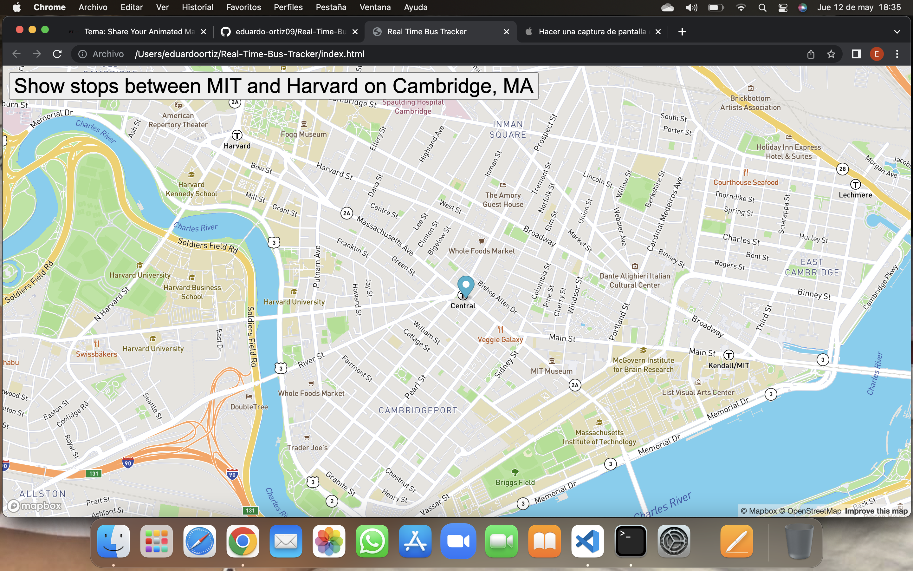

# Real-Time-Bus-Tracker
Live motion of a public bus in Cambridge, MA

 
  

&#xa0;

<h1 align="center">Real Time Bus Tracking</h1>

  <a href="#dart-descrition">Description</a> &#xa0; | &#xa0; 
  <a href="#rocket-How-To-Run">How to run</a> &#xa0; | &#xa0;
  <a href="#white_check_mark-Roadmap-of-future-improvements">Roadmap of future improvements</a> &#xa0; | &#xa0;
  <a href="#memo-license">License</a> &#xa0; | &#xa0;
  <a href="https://github.com/eduardo-ortiz09" target="_blank">Author</a>

 

## :dart: About

Show stops between MIT and Harvard on Cambridge, MA

## :rocket: How-to-run

Copy the repo to your PC and open index.html file

## :white_check_mark: Roadmap-of-future-improvements

Add images to marker

## :memo: License

This project is under license from GNU. For more details, see the [LICENSE](LICENSE) file.

Made by <a href="https://github.com/eduardo-ortiz09" target="_blank">eduardo-ortiz09</a>

&#xa0;

<a href="#top">Back to top</a>